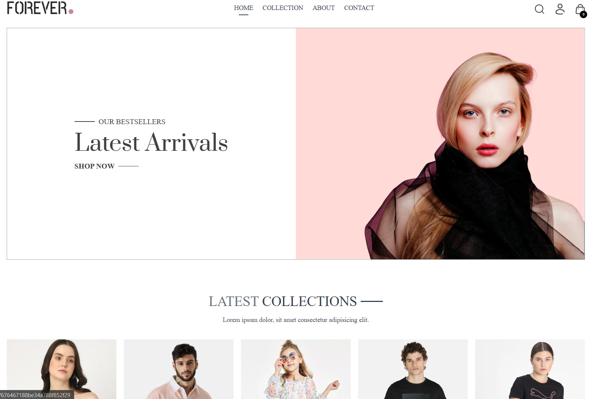

# E-commerce MERN Stack Application - Forever Clone

    This project is an e-commerce web application built using the MERN (MongoDB, Express, React, Node.js) stack. It includes three major components:

    Admin Panel: Allows administrators to manage orders and products.

    Backend: Provides APIs and database management.

    Frontend/UI: Enables users to browse, order products, and view order status.

# Features

## Admin Panel

    View, add, update, and delete products.

    Manage orders: update order status, cancel orders, etc.

    Dashboard to view key metrics (e.g., total orders, revenue).

## Backend

    RESTful APIs for product management, order processing, and user authentication.

    MongoDB for database storage.

    JWT-based user authentication.

    Secure and scalable architecture.

## Frontend/UI

    User-friendly interface for browsing and ordering products.

    Shopping cart functionality.

    User registration and login.

    Order history and status tracking.